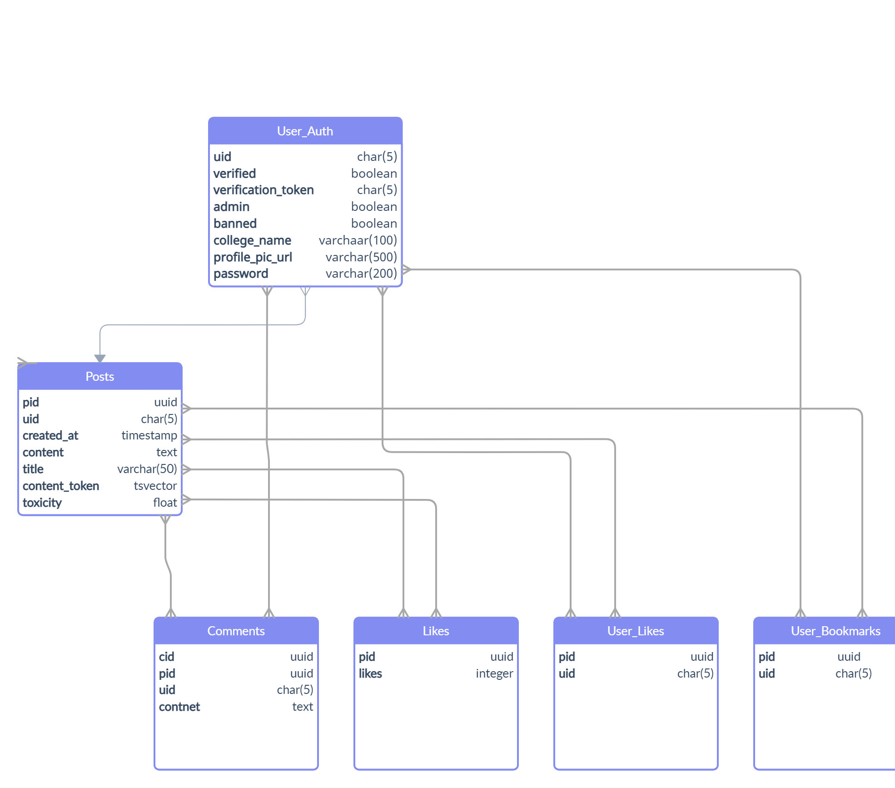

### <p align="center"><u> Cloak</u><p>

<p align="center"> Connect with folks from universities across the globe. Share your stories, experiences and feedback</p>

**Webapp live at: [Here](https://cloak-gilt.vercel.app/)**

**Note: For now it uses domain of iiit-bh.ac.in. But you can use test email for checking the app**

### Libraries and Frameworks used

- Used **Postgres** for database
- **Sendgrid** for sending verification mail
- **Tensorflow** for flagging offensive/harmful content
- **Express** for the backend framework
- **NextJS** for the frontend
- **Mantine** for UI Components
- **Axios** for making API Calls
- **js-Cookie** for storing and accessing cookies in browser
- **nookies** for storing and accessing cookies from nextjs app

### Features

- Machine Learning model is used to flag offensive/harmful content. Users can choose to view or ignore these posts.
- Users can perform all operations like posting, liking, bookmarking and deleting.
- Email verification is used to prevent spam.
- Only users with verified domain are allowed to sign up (Just like blind).
- Admin dashboard to ban / verify users and add new domain address.

### API Documentation

| Type   | Route                         | Access  | Description                                               |
| ------ | ----------------------------- | ------- | --------------------------------------------------------- |
| POST   | /api/signup                   | Public  | Allows new user to signup                                 |
| POST   | /api/login                    | Public  | Allows user to login                                      |
| GET    | /api/verify/:token            | Public  | Verifies user                                             |
| GET    | /api/user                     | Private | Returns user details                                      |
| POST   | /api/post                     | Private | Allows user to make a new post                            |
| GET    | /api/post/:offset/:limit      | Private | Returns latest post from [offset offset + limit)          |
| POST   | /api/like                     | Private | Allows users to like a post                               |
| POST   | /api/bookmarks                | Private | Allows user to bookmark a post                            |
| GET    | /api/singlepost/:pid          | Private | Returns one post with pid                                 |
| GET    | /api/bookmarks/:offset/:limit | Private | Returns all bookmarked post from [offset, offset + limit) |
| GET    | /api/user/post/:offset/:limit | Private | Returns all liked post from [offset, offset + limit)      |
| DELETE | /api/post/:pid                | Private | Deletes the post with id pid                              |
| GET    | /api/admin/users              | Admin   | Gets all users                                            |
| POST   | /api/admin/user               | Admin   | Updates user details                                      |
| GET    | /api/admin/colleges           | Admin   | Gets all colleges                                         |
| POST   | /api/admin/college            | Admin   | Adds a new college to the list                            |

### Database design

</img>

### Install the frontend

```bash
git clone https://github.com/Avash027/cloak.git
cd cloak
npm install
npm run dev
```

Set up the enviroment variables

```
ENV = DEVELOPMENT/PRODUCTION
```

### Install the backend

```bash
git clone https://github.com/Avash027/cloak-server.git
cd cloak-server
npm install
npm run dev
```

Set the enviroment variables

```
DB_HOST =
DB_DATABASE =
DB_PASSWORD =
DB_PORT =
DB_USER =
DB_MAX =
NODE_ENV = DEVELOPMENT/PRODUCTION
SECRET =
SENDGRID_MAIL_KEY =
PORT =
```
